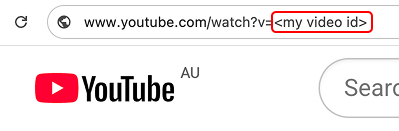
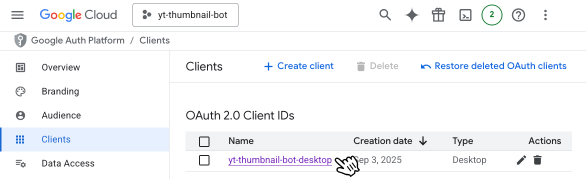
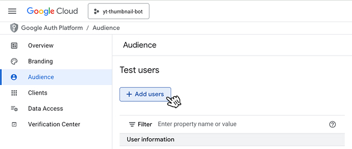

# Farm YouTube engagement using live thumbnails

Growth strategy: users who comment on your video appear on your thumbnail in semi-real-time.

TODO: GIF here (mix in capcut, screen record, convert to GIF keep mp4 preview JIC)

<details>
<summary>1. Any prerequisites?</summary>

### Your video ID


### Your thumbnail
To keep things simple, the base thumbnail has 5 slots for PFPs (positions hard-coded). This can be changed, for example, pasting hundreds of small PFPs covering the entire thumbnail. Check Google's docs for thumbnail limitations (e.g., must be <2MB). You may also need to verify via YouTube's frontend to be allowed to set custom thumbnails (edit the video in the browser and click custom thumbnail to get prompted) from here on, you can set via the API.
 

### Your YouTube API access
Using an API key is simple for reads (listing comments) but OAuth is required for writes (setting thumbnails). Unfortunately, there is no silver-bullet (permanent auth) for backend to backend (this webapi to YouTube's api). You will need to perform an initial interactive login as the channel owner to obtain a refresh token, which will then be an environment variable to keep the access token fresh.

Lifespan of a refresh token? as of writing, they appear to be long-lived (~600k seconds ≈ 7 days). This is plenty of time for this project's purpose. Recommend storing in a secrets vault (e.g., Azure Key Vault) and restart API/create an operations endpoint to ping and hot reload the YouTube client with the new refresh token.

1. Generate your Google OAuth Client [here](https://console.cloud.google.com/apis/credentials) (desktop to avoid needing redirect URLs etc)
   
1. Take note of your **Client ID** and **Client Secret**
2. You may need to add your account (channel owner account) as a test user if your app is unpublished
   
3. Run in [root](.), login, and take note of your **Refresh Token**
   ```shell
   chmod +x script_to_obtain_refresh_token.py
   ./script_to_obtain_refresh_token.py
   ```
4. Run in [root](.) and populate the environment
   ```shell
   cp .env.example .env
   ```

</details>

<details>
<summary>2. How do I use it?</summary>

- Assumes you're using asdf (last using Python 3.13.7)
- Assumes your YouTube API daily quota is full (wait 24h if not)
- How to start the web API? Run in [root](.)
  ```shell
  python3 -m venv venv
  source venv/bin/activate
  pip install -r requirements.txt
  fastapi dev app
  ```
- How to test the web API? See [app.http](app.http) then cURL or [REST Client](https://marketplace.visualstudio.com/items?itemName=humao.rest-client)

</details>

<details>
<summary>3. Next steps?</summary>

Recommending:
- Run the web API on a VPS, example: [Digital Ocean Droplet @ $4/month](https://www.digitalocean.com/pricing)
- Run a CRON job on the VPS to trigger endpoint every X minutes, example:
  ```shell
  */4 * * * * curl -s -H "Accept: application/json" "http://localhost:8000/farm-engagement?limit={{num_of_top_comments}}&video_id={{video_id}}" > /dev/null 2>&1
  ```
- Persist current progress in an external DB (user's processed, next cursor position to paste PFP, latest thumbnail, etc)

</details>

<details>
<summary>4. FAQ</summary>

### _"So this gets the top comments?"_
YouTube's _order by relevance_ query param when fetching the top comments is not the same algo as the one you see on YouTube's frontend - they are similar (enough to get the job done) but not 1:1

### _"Why not just fetch all comments so we have more control?"_
Yes this guarentees that we always rank comments with 100% accuracy and allows us to promise for example "top 3 comments with the most likes get chosen...". This is a tradeoff issue between using more of our daily quota VS maintaining a near-real-time cadence for thumbnail refreshes.

This would require more reads (for pagination) and more compute to re-check all comments per run (old comments can always gain more likes), exponential reads (n pages each run) this would also require us to scale down how often we refresh the thumbnail (based on our remaining quota) (may defeat the purpose)
Prefer simplicity (get the top 100 based on Google's relevance ordering) (1x read every time) and use a fixed cadence (2 mins to allow for reliable updates (costs 50 units))

### _"Any improvements?"_
- You can add filters to only process users who have liked/commented/subscribed - maxxing interactions
- (maybe go in next steps/combine these sections) Persist the current progress in a DB  (cursor position for the next pfp, latest banner, etc) and load each run to ensure resiliency (no data loss upon server restarts, crahes, etc)
- More dynamic (lower image quality if over 2MB limit), dynamic cadence (scale down) based on available quota, fetch comments paginated (users more reads)

</details>
